<p align="center">
  
</p>

<p align="center">
  <strong>Mass LICENSE production — stamp a license into every repo that lacks one.</strong>
</p>

<p align="center">
  <a href="https://dacameragirl.github.io/license-zapper/"></a>
  <a href="https://github.com/DaCameraGirl/license-zapper"></a>
</p>

<p align="center">
  
  
</p>

### Languages

<p align="center">
  
</p>

### Stack

<p align="center">
  
  
</p>

<p align="center">
  Built by <strong>Angela Hudson</strong> · <a href="https://github.com/DaCameraGirl">DaCameraGirl</a>
</p>
<h1 align="center">license-zapper 🐸⚡</h1>

<p align="center">
  <b>Mass LICENSE production for GitHub.</b><br>
  One command. Every bare repo. <i>Zapped.</i> 💚
</p>

<p align="center">
  
  
  
  
</p>

---

A repo with no `LICENSE` is a little frog with no fireflies — legally it's
"all rights reserved" by default, but it *looks* unfinished and leaves people
unsure what they can do. **license-zapper** hops through every repo on your
account, finds the bare ones, and zaps a license right in through the GitHub
API. No cloning twenty repos by hand. 🪰⚡

**Dry-run by default** — nothing changes until you say `--go`.

<p align="center"></p>
<p align="center"></p>


```bash
bash zap-licenses.sh                     # 👀 dry run — see what it WOULD do
bash zap-licenses.sh --license mit       # 👀 dry run, MIT
bash zap-licenses.sh --go                # ⚡ stamp the proprietary license
bash zap-licenses.sh --license mit --go  # ⚡ stamp MIT
```

<p align="center"></p>
<p align="center"></p>


| Flag | Default | What it does |
| --- | --- | --- |
| `--owner <name>` | `DaCameraGirl` | GitHub account to scan |
| `--license <type>` | `proprietary` | `proprietary` or `mit` |
| `--name <name>` | `Angela Hudson` | Name written into the license |
| `--year <year>` | current year | Copyright year |
| `--only <a,b>` | (all) | Only zap these repos |
| `--exclude <a,b>` | retiring repos | Never zap these repos |
| `--include-archived` | off | Also include archived repos |
| `--go` | off (dry run) | Actually write the LICENSE |

<p align="center"></p>
<p align="center"></p>


- 🐸 **Dry run unless `--go`.** Look before you leap.
- ⏭️ Skips any repo that already has a license.
- 🔒 Skips archived (read-only) repos unless you ask for them.
- 🎯 `--only` / `--exclude` for precise aim.

<p align="center"></p>
<p align="center"></p>


- [GitHub CLI](https://cli.github.com/) (`gh`), authenticated: `gh auth login`
- `bash` + `base64` (Git Bash on Windows works fine)

<p align="center"></p>
<p align="center"></p>


Born the night of **2026-06-12** out of a joke — *"lol I wish I could just zap
all my repos with a license"* — and shipped about an hour later. On his very
first run he snapped up **20 bare repos** in one pass. Full story in the
[changelog](CHANGELOG.md). 🐸⚡🪰

---

<p align="center">
  Built by <b>Angela Hudson</b> · DaCameraGirl 💖<br>
  <sub>Copyright © 2026 Angela Hudson. All Rights Reserved. See <a href="LICENSE">LICENSE</a>.</sub>
</p>